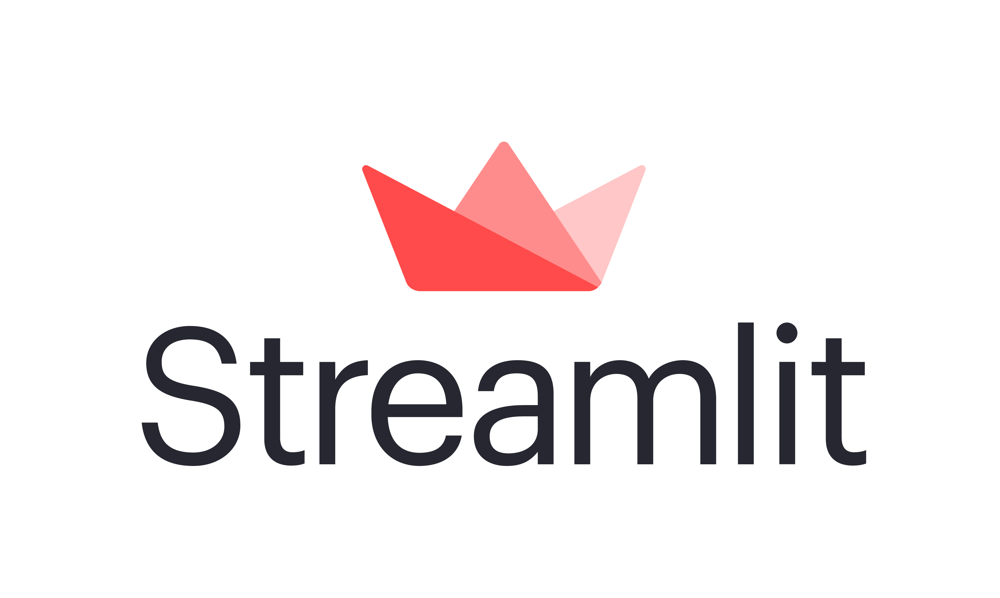

# Gender Classifyer ML App with Streamlit

<!-- PROJECT LOGO -->
 

  

  <h3 align="center">STREAMLIT</h3>

  

    Using Streamlit!
     
    <a href="https://github.com/itzanuragsinghania?tab=repositories"><strong></strong></a>
     
     
    <a href="https://share.streamlit.io/itzanuragsinghania/gender-classifyer/main/app.py">View Demo</a>
    ·
    <a href="https://github.com/itzanuragsinghania/Gender-Classifyer/issues">Report Bug</a>
    ·
    <a href="https://github.com/itzanuragsinghania/Gender-Classifyer/issues">Request Feature</a>
    ·
    <a href="https://github.com/itzanuragsinghania/Gender-Classifyer/pulls">Send a Pull Request</a>
  

# DEMO
[Sharing_Link](https://bit.ly/3fqVAhZ)
<!-- TABLE OF CONTENTS -->
## Table of Contents

* [About the Project](#about-the-project)
  * [Built With](#built-with)
* [Getting Started](#getting-started)
* [Usage](#usage)
* [Contributing](#contributing)
* [License](#license)
* [Contact](#contact)
* [Acknowledgements](#acknowledgements)

<!-- ABOUT THE PROJECT -->
## About The Project

This is a  WebApp made using Machine Learning Models mainly using  NaiveBayes model and frontend made using Streamlit, the app is also deployed and shared using Streamlit Sharing.

Here's why:
* Your time should be focused on creating something amazing. A project that solves a problem and helps others
* It might help in the long run.
* You should Impelement DIY principles to the rest of your life :smile:

The webapp inputs a Name and try's to guess the gender of the name , for which has been trained in a dataset of names.

### Built With
This section should list any major frameworks that you built your project using. Leave any add-ons/plugins for the acknowledgements section. Here are a few examples.
* [Streamlit](https://www.streamlit.io/)
* [Streamlit Sharing](https://www.streamlit.io/sharing-sign-up)
* [Python](https://www.python.org/)

<!-- GETTING STARTED -->
## Getting Started

1. Fork this repository.
2. Give me a star. 
3. Follow me.
4. Sign up for [Streamlit](https://www.streamlit.io/)
6. Request for [Streamlit Sharing](https://www.streamlit.io/sharing-sign-up)
7. Your Github Email must match the Streamlit email.
8. For More [STEPS](https://blog.streamlit.io/introducing-streamlit-sharing/)

Alternatively see the GitHub documentation on [creating a pull request](https://help.github.com/en/github/collaborating-with-issues-and-pull-requests/creating-a-pull-request).

<!-- USAGE EXAMPLES -->
## Usage

The project can be used to predict gender on the basis of names.

<!-- CONTRIBUTING -->
## Contributing

Contributions are what make the open source community such an amazing place to be learn, inspire, and create. Any contributions you make are **extremely appreciated**.

1. Fork the Project
2. Create your Feature Branch (`git checkout -b feature/AmazingFeature`)
3. Commit your Changes (`git commit -m 'Add some AmazingFeature'`)
4. Push to the Branch (`git push origin feature/AmazingFeature`)
5. Open a Pull Request

<!-- LICENSE -->
## License

Distributed under the MIT License. [LICENSE](LICENSCE)

## Contact

LinkedIn- [Anurag Singhania](https://www.linkedin.com/in/anurag-singhania-39623217b/)

Instagram- [@cursed_by_hatred](https://www.instagram.com/cursed_by_hatred/) - 

Gmail-[Anurag Singhania](anuragsinghania235@gmail.com)

Repo  Link: [Gender-Classifyer](https://github.com/itzanuragsinghania/Gender-Classifyer)

<!-- ACKNOWLEDGEMENTS -->
## Acknowledgements
* YouTube-[JCharisTech & J-Secur1ty](https://www.youtube.com/channel/UC2wMHF4HBkTMGLsvZAIWzRg)
* Github-[JCharis](https://github.com/Jcharis)

## By
+ [Anurag Singhania](https://github.com/itzanuragsinghania)

